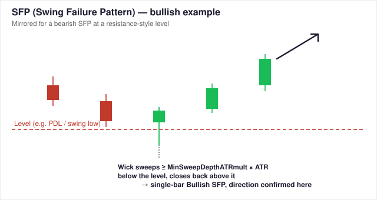
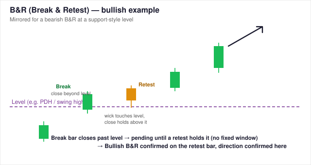
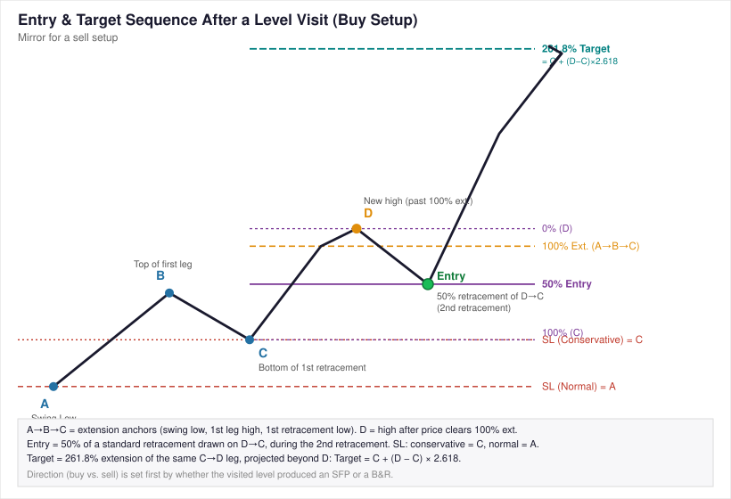

# SwingBreakout SFP/B&R Suite

**This is a [cTrader](https://ctrader.com) algo** - two cAlgo (cTrader's
C#/.NET algo API) projects implementing an SFP (Swing Failure Pattern) / B&R
(Break & Retest) trading method with an A-B-C-D fib-extension entry
sequence, split into a pure signal indicator and an execution robot:

- **`Indicators/SwingBreakoutSFPSignal/`** — the indicator. Detects SFP and
  B&R reactions at PDH/PDL/PDC, month-to-date close highs/lows, and swing
  highs/lows; runs the A-B-C-D entry sequence; applies an SMA trend-regime
  filter; and identifies consolidation from a compressed, low-efficiency
  rolling range. No order or position logic. See `STRATEGY.md` for the full
  method with diagrams.
- **`Robots/Swingbreakouttrader/`** — the execution robot. Drives the
  indicator via `Indicators.GetIndicator<SwingBreakoutSFPSignal>(...)` and
  handles only trade management: sizing, stop/target placement (taken
  as-is from the indicator), breakeven, trailing stop, and entry-side
  filters (spread, session, clustering, opposite-direction blocking). Its
  opt-in **Enable Confidence Mode** treats a confirmed green confidence dot
  as a buy signal and a red dot as a sell signal; dot entries use the
  pivot-to-confirmation range as their stop and a 2R target. It always
  rejects new entries while the indicator identifies consolidation.

## Build

Each project is a standalone `net6.0` class library targeting the
`cTrader.Automate` package. The robot's `.csproj` has a `ProjectReference`
to the indicator's `.csproj`, so building the robot also builds the
indicator:

```
cd Robots/Swingbreakouttrader/Swingbreakouttrader
dotnet build
```

To build inside cTrader Automate itself (rather than via `dotnet build`),
create the indicator algo first, then create the robot algo and add the
indicator's `.cs` files (`SwingBreakoutSFPSignal.cs` and
`SharedSignalDefaults.cs`) to the same robot project before building — see
the header comments in `Swingbreakouttrader.cs` for the full setup notes.

## Developer: cTrader Automate workspace

For development in cTrader Automate, link its local source workspace to
this repository rather than maintaining a second copy of either project.
The linked folders are:

- `Indicators/SwingBreakoutSFPSignal/`
- `Robots/Swingbreakouttrader/`

| Platform | Default local source workspace | Notes |
|---|---|---|
| Windows desktop | `%USERPROFILE%\Documents\cAlgo\Sources` | Use a directory junction from PowerShell. |
| macOS desktop | `~/cAlgo/Sources` | Use symbolic links. |
| Linux | `~/cAlgo/Sources` when created by local cTrader tooling | Use symbolic links if the local workspace exists. |
| Web and mobile | None | These clients do not expose a local Automate source workspace. Develop/build on desktop or with the CLI. |

Before creating either link, make sure the destination does **not** already
exist. If it contains work you need, move it to a backup location first.

### macOS and Linux

Run these commands from the repository root:

```bash
workspace="$HOME/cAlgo/Sources"
repo="$(pwd)"

mkdir -p "$workspace/Indicators" "$workspace/Robots"
ln -s "$repo/Indicators/SwingBreakoutSFPSignal" \
  "$workspace/Indicators/SwingBreakoutSFPSignal"
ln -s "$repo/Robots/Swingbreakouttrader" \
  "$workspace/Robots/Swingbreakouttrader"
```

Confirm that both paths resolve into the repository:

```bash
readlink "$workspace/Indicators/SwingBreakoutSFPSignal"
readlink "$workspace/Robots/Swingbreakouttrader"
```

### Windows

Open **PowerShell** from the repository root and create directory junctions:

```powershell
$workspace = Join-Path $env:USERPROFILE "Documents\cAlgo\Sources"
$repo = (Resolve-Path .).Path

New-Item -ItemType Directory -Force -Path "$workspace\Indicators", "$workspace\Robots"
New-Item -ItemType Junction -Path "$workspace\Indicators\SwingBreakoutSFPSignal" `
  -Target "$repo\Indicators\SwingBreakoutSFPSignal"
New-Item -ItemType Junction -Path "$workspace\Robots\Swingbreakouttrader" `
  -Target "$repo\Robots\Swingbreakouttrader"
```

Use `Get-Item "$workspace\Indicators\SwingBreakoutSFPSignal"` and
`Get-Item "$workspace\Robots\Swingbreakouttrader"` to confirm that each
item is a junction. Open or build the linked source in cTrader Automate;
changes made from cTrader are then changes in this Git repository.

## Developer: TradingView Pine indicator

The TradingView-only indicator is a Pine Script v6 translation at:

`Indicators/SwingBreakoutSFPSignal/SwingBreakoutSFPSignal/SwingBreakoutSFPSignal.pine`

It contains the indicator-side strategy only: active swing and daily levels,
SFP/B&R detection, the A-B-C-D entry sequence, higher-timeframe trend
filter, confidence dots, consolidation highlighting, stop/target plots, and
alert conditions. It does **not** contain cTrader robot, order, or position
management code.

To install it in TradingView:

1. Open **Pine Editor** on a chart.
2. Create a new indicator script, replace its contents with the `.pine` file
   above, then click **Save** and **Add to chart**.
3. Create TradingView alerts from the script's bullish/bearish entry or
   green/red confidence-dot alert conditions as needed.

The Pine version uses TradingView's chart-bar volume direction
(close above/below open) as the portable confidence proxy. The cTrader
version can classify lower-timeframe tick-volume bars inside each chart bar,
so confidence-dot colors can differ between the two platforms when their
available volume data differs.

## Consolidation filter

The cTrader robot always blocks new entries while the indicator marks a
consolidation. A consolidation begins when ADX is below `Consolidation Max
ADX` (17 by default) and becomes active only after `Consolidation Min. Bars`
(15 by default) remain below that threshold.

While ADX remains below the threshold, the indicator tracks and displays the
range high, low, and midpoint. A rise back above the threshold clears the
range. The Pine indicator uses the same visual classification but, as an
indicator, does not place or block trades.

## Parameter defaults

The 10 parameters shared between both algos are forwarded **positionally**
from the robot to the indicator via `GetIndicator<T>(...)` — see the
header comment in `Swingbreakouttrader.cs` before reordering any of them.
Their default values live in one place,
`Indicators/SwingBreakoutSFPSignal/SwingBreakoutSFPSignal/SharedSignalDefaults.cs`,
referenced by both files' `[Parameter]` attributes.

## Strategy diagrams







See [`Indicators/SwingBreakoutSFPSignal/STRATEGY.md`](Indicators/SwingBreakoutSFPSignal/STRATEGY.md) for the full write-up these diagrams belong to.

## Testing status

Tested on **XAUUSD** with the robot's **default parameters** (matching the
tested XAUUSD M1 `.cbotset`), via `ctrader-cli backtest`, M1, $200 starting
balance: one 3-day run (08/09/2026-11/09/2026, +23.11% ROI, 1 trade), five
more 3-day windows randomized within a single week (31/08-06/09/2026), and
three full-week runs, one per month across June-August 2026. See
[`Robots/Swingbreakouttrader/BACKTESTS.md`](Robots/Swingbreakouttrader/BACKTESTS.md)
for the full write-up, method, and caveats — including three overlapping
windows that captured the same trade (not independent samples), an observed
backtest-boundary anomaly, and a direct statement that the aggregate across
all 9 runs currently leans losing/flat rather than showing a demonstrated
edge — read those caveats before treating any of this as validation. Raw
report JSON for all nine runs is attached under
[`Robots/Swingbreakouttrader/backtests/`](Robots/Swingbreakouttrader/backtests/).

## Disclaimer

Always run on a demo account and backtest across a meaningful date range
and multiple symbols before pointing this at a live account. Nothing here
is investment advice, and historical/backtested performance is not a
guarantee of future results.
